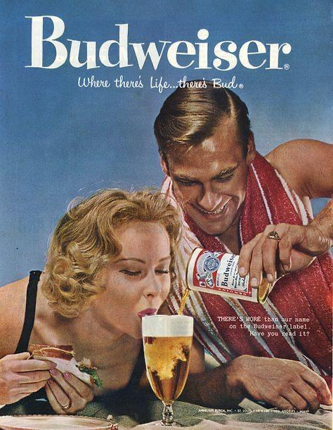
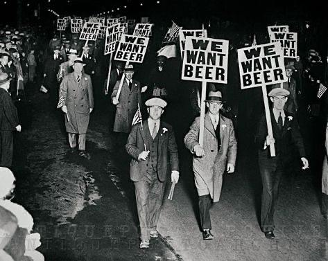
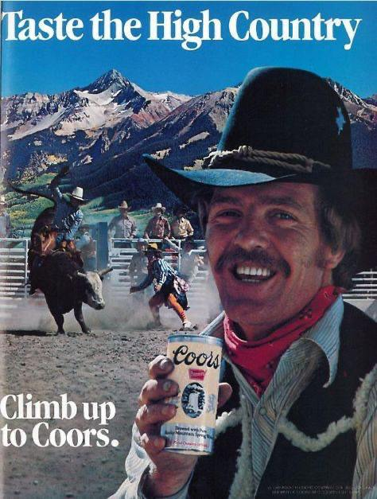

# Introduction

Countries often claim that they have the “best” beer, in this article we are going to analyse the US and see if we can quantify a bias that people from different states have for each other's beers. Does the state you are from influence your beer preferences, especially towards beers coming from your own state? More generally, by examining the data from the Beer Advocate beer review website, we aim to uncover links between a user's geographical location, and how they rate beers. We were inspired by different regions of the world having similar food, so to try and find trends in beer data we’re going to start with a ‘regional’ analysis of states. Additionally, we will attempt to explain and find reasons for the bias in preference by looking at various factors, such comparing specifically neighbouring states, or analysing differences in beer style preferences.

  <!-- Première image -->
  

    
    
Légende pour Image 1

  

  <!-- Deuxième image -->
  

    
    
Légende pour Image 2

  

  <!-- Troisième image -->
  

    
    
Légende pour Image 3

  

# The data used
We valued having large, high-quality datasets to uncover trends in beer preferences and biases. By looking at the distributions of beers and users by country/ state of origin in the Beer Advocate dataset, we were able to notice that most users came from the US. Not only this, but we can see that the more beers a certain country or state creates, the more reviews they have; for both local and non-local reviews. For this graph, we define local reviews as reviews where the user and beer of interest are from the same state/country. All other reviews are non-local reviews.

It’s interesting to note that there is a positive correlation between the number of beers that a state produces, the more local and non local reviews a state has. Indeed it seems that the bigger the state/country, the more beers it produces and also the more users on the website it has which further supports our need to select the US states as our geographical region of interest due to its abundance of data with regards to both users and beers. 
Moreover, after comparing the Beer Advocate and Rate Beer datasets, we observed that Beer Advocate was more focused on the US, aligning better with our goal of analyzing US-based geographical biases. 

# 1) Do regions like the same kind of beer?

    <iframe src="/assets/img/question1/custom_region.html" 
            width="2000" 
            height="700" 
            style="border: none;" 
            title="Interactive Plot: Regional Analysis">
    </iframe>

# 2) Do we see significant differences between regions when comparing beer ratings?
After identifying trends within individual regions, we extended our analysis to compare beer ratings between regions. Our goal was to detect whether significant differences existed between how regions rated their own beers (in-region ratings) compared to beers from outside regions (out-region ratings). To quantify this, we used Cohen’s D, a statistical measure that assesses the standardized difference between two means. Cohen's D < 0.2 indicates a negligible difference. To explore regional biases in beer ratings, we conducted a two-part analysis:

## Neighboring bubbles analysis 

We first examined whether users in each neighboring  bubble showed preferences for beers in their bubble compared to outside. However, all Cohen’s D were below 0.2, meaning there was no statistically significant difference between the ratings.

    <iframe src="/assets/img/question2/neighbours_regions_cohend.html" 
            width="800" 
            height="500" 
            style="border: none;" 
            title="Interactive Plot: Regional Analysis">
    </iframe>

## Custom region analysis
Next, we analyzed the regions we constructed earlier based on insights from the neighboring regions analysis of part 1 to see if we can see more trends. For these custom clusters, we compared in-region and out-region ratings using Cohen’s D. Again, all Cohen’s D values remained below 0.2, confirming that users did not rate beers from their own regions significantly higher.

    <iframe src="/assets/img/question2/regional_on_question1.html" 
            width="800" 
            height="500" 
            style="border: none;" 
            title="Interactive Plot: Regional Analysis">
    </iframe>

# 3) Looking at the state level, do we see more trends ? By doing a sentiment analysis do the text reviews reveal similar trends ? 

## Ratings analysis

## Sentiment analysis

# 4) Looking deeper into preferences, does separating by beer style reveal a style specific bias that could explain these differences in ratings?

    <iframe src="/assets/img/question4/dbscan_clustering_on_umap.html" 
            width="1000" 
            height="1200" 
            style="border: none;" 
            title="Interactive Plot: Regional Analysis">
    </iframe>

    <iframe src="/assets/img/question4/usa_state_cluster_based_on_dbscan.html" 
            width="1000" 
            height="1200" 
            style="border: none;" 
            title="Interactive Plot: Regional Analysis">
    </iframe>

# 5) Going the other way around, if we cluster beers by beer attributes and ratings, do we see regional bias ?

  

  <!-- Dropdown Selector -->
  

    <label for="k-dropdown">Select k:</label>
    <select id="k-dropdown">
      <option value="3">k = 3</option>
      <option value="4">k = 4</option>
      <option value="5">k = 5</option>
      <option value="6">k = 6</option>
      <option value="7">k = 7</option>
      <option value="8">k = 8</option>
      <option value="9">k = 9</option>
      <option value="10">k = 10</option>
    </select>
  

  <!-- Slider -->
  

    <label for="k-slider">Or use the slider:</label>
    <input id="k-slider" type="range" min="3" max="10" value="3" step="1">
    3
  

  <!-- Frame to Display the HTML Files -->
  <iframe id="map-frame" src="assets/img/question5/clustering_by_beer_attributes_k3.html"></iframe>

  

